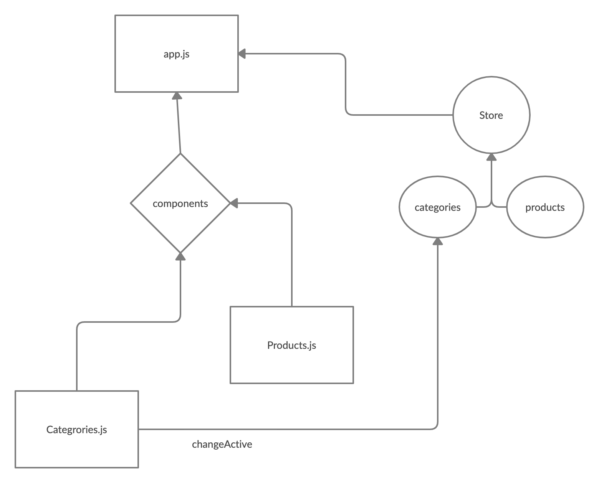

# Virtual Store

**Author**: Abdallah Safi

**Version**: 1.0.0 

## Overview
An online shopping portal for a fictional store

## Getting Started

These instructions will get you a copy of the project up and running on your local machine for development and testing purposes. See deployment for notes on how to deploy the project on a live system.

## Prerequisites

- Operating system: Mac OS, Windows, Linux
- Git
  Follow the instruction in the links below to install git in your machine
  - [Windows](https://git-scm.com/download/win)
  - [Mac OS](https://git-scm.com/download/mac)
  - [Linux](https://git-scm.com/download/linux)
- [Codeing Editor](https://www.wpbeginner.com/showcase/12-best-code-editors-for-mac-and-windows-for-editing-wordpress-files/)

## Installation

1. open your terminal

2. Clone the repo

`git clone https://github.com/abdallahsafi-401-advanced-javascript/storefront.git`

## Architecture

This application was build with react.js javaScript framework and it includes:
- **Material UI** for user interface design

# UML diagram

## Change Log
25-10-2020 4:30pm 
